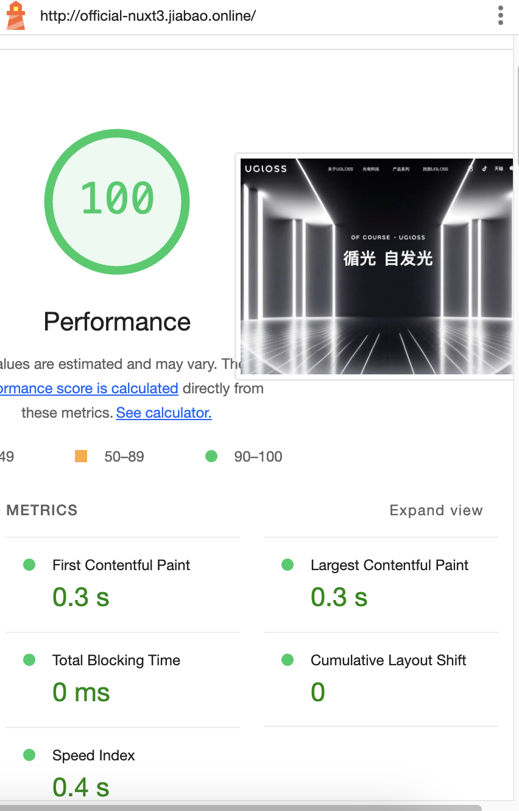

# 🚀 基于 Nuxt3.js 的全屏滚动企业官网模板

> 该项目基于某公司定制，图片资源皆为线上资源，若您需要使用，请按自身需要修改。
> 该项目已经过多次优化，细节性较强

> 此外还有一个基于Astro企业官网，感兴趣可以到 [https://github.com/CallBoson/official-astro](https://github.com/CallBoson/official-astro)

若您喜欢该项目，可以给我一个 Star ⭐️ ，非常感谢！

## 线上体验（网站已过期）：[http://official-nuxt3.jiabao.online/](http://official-nuxt3.jiabao.online/)

## lighthouse 首屏测试



## 特性

- 支持所有屏幕响应式布局
- 移动端专属设计
- I18n 多语言设计
- 首屏占位背景，秒开首屏
- 精美 UI 设计；
- UI 动画设计

## 🧰 技术栈

- Nuxt3.js
- Tailwind CSS
- @nuxtjs/i18n

## 🎯 前置要求

建议 `Node版本 >= 18`

## 🏗️ 命令

你可以通过以下命令来启动开发服务器：

```
npm run dev
```

你可以通过以下命令来构建`服务端渲染（SSR）`

```
npm run build
```

你可以通过以下命令静态生成`Nuxt应用程序（SSG）`

```
npm run generate
```

## 部署

正常来说只需要使用 SSG 部署静态页面即可，运行`npm run generate`并部署到服务器即可。
该项目使用了`nuxt-simple-sitemap`，可自动配置 sitemap，因此在部署前，你需要在`nuxt.config.ts` > `site`中修改`url`为你的网站地址。

## Author

有任何疑问欢迎提交Issue或添加我微信：cbdljb
欢迎web企业官网定制
Jiabao. 2024
